:head:
#+title: Quimb figures
#+author:    Vijay Gopal Chilkuri
#+email:     vijay.gopal.c@gmail.com
#+DATE: <2026-02-07 Sat>
#+PROPERTY: header-args:python :session *Python* :async :results none
:end:

* Introduction
** Setup
#+begin_src python
from quimb import schematic
import numpy as np

presets = {
    "bond": {"linewidth": 3},
    "phys": {"linewidth": 1.5},
    "center": {
        # `get_color` uses more colorblind friendly colors
        "color": schematic.get_color("orange"),
        #"hatch": "/////",
    },
    "left": {
        "color": schematic.get_color("bluedark"),
    },
    "right": {
        "color": schematic.get_color("blue"),
    },
}

#+end_src
** Notation

*** Vector
#+begin_src python :file figs/intro1.png
d = schematic.Drawing(presets=presets)
d.circle( (0, 0), preset = "center")
#d.line( (0, 0), (0, 2/3), preset="phys" )
#d.line( (0, 0), (1, 0), arrowhead=dict(center = 0.5) )
#d.line( (0, 0.1), (1, 0.1), arrowhead=dict(center = 0.5, reverse=True) )
#d.line( (0,-0.1), (1,-0.1), arrowhead=dict(center = 0.5, reverse=True) )
d.line( (0, 0.0), (-1, 0.0), arrowhead=dict(center = 0.5) )
d.fig.savefig("figs/intro1.png")
#+end_src

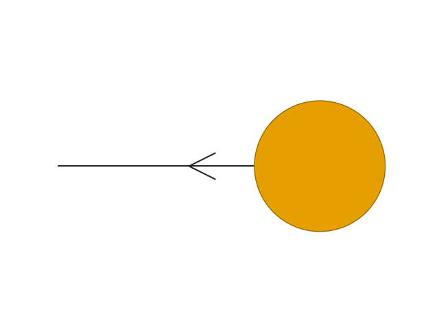

*** Matrix
#+begin_src python :file figs/intro2.png
d = schematic.Drawing(presets=presets)
d.circle( (0, 0), preset = "center")
#d.line( (0, 0), (0, 2/3), preset="phys" )
d.line( (0, 0), (-1, 0), arrowhead=dict(center = 0.5) )
d.line( (0, 0), (1, 0), arrowhead=dict(center = 0.5, reverse=True) )
d.fig.savefig("figs/intro2.png")
#+end_src

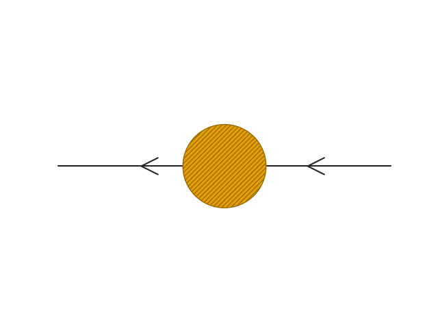

*** Tensor
#+begin_src python :file figs/intro3.png
d = schematic.Drawing(presets=presets)
d.circle( (0, 0), preset = "center")
d.line( (0, 0), (-1, 0), arrowhead=dict(center = 0.5), text=dict(text="I3\n", fontsize=28) )
d.line( (0, 0), (0, 2/3), preset="phys", text=dict(text="I2\n", fontsize=28, center=0.7))
d.line( (0, 0), (1, 0), arrowhead=dict(center = 0.5, reverse=True), text=dict(text="I1\n", fontsize=28) )
d.fig.savefig("figs/intro3.png")
#+end_src

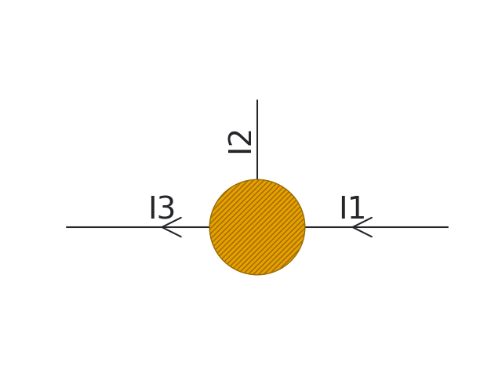
*** Tensor n-gon left
#+begin_src python :file figs/intro3_2.png
d = schematic.Drawing(presets=presets)
d.regular_polygon( (0, 0), n=3, orientation=np.pi/2, preset = "center")
d.line( (0, 0.1), (1, 0.1), arrowhead=dict(center = 0.5, reverse=True) )
d.line( (0,-0.1), (1,-0.1), arrowhead=dict(center = 0.5, reverse=True) )
d.line( (0, 0.0), (-1, 0.0), arrowhead=dict(center = 0.5) )
d.fig.savefig("figs/intro3_2.png")
#+end_src
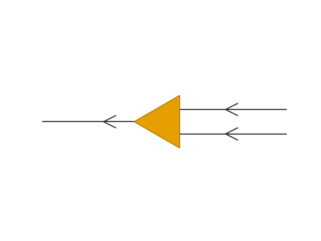
*** Tensor n-gon right
#+begin_src python :file figs/intro3_3.png
d = schematic.Drawing(presets=presets)
d.regular_polygon( (0, 0), n=3, orientation=-np.pi/2, preset = "center")
d.line( (0, 0.1), (-1, 0.1), arrowhead=dict(center = 0.5, reverse=True) )
d.line( (0,-0.1), (-1,-0.1), arrowhead=dict(center = 0.5, reverse=True) )
d.line( (0, 0.0), ( 1, 0.0), arrowhead=dict(center = 0.5) )
d.fig.savefig("figs/intro3_3.png")
#+end_src
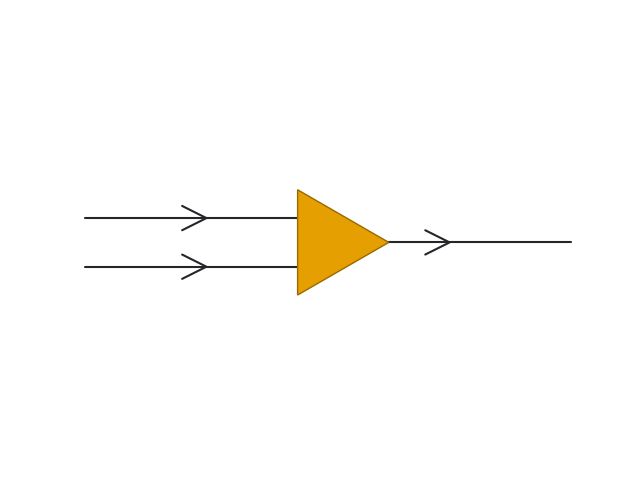
*** Bezier
#+begin_src python :file figs/intro3_4.png
d = schematic.Drawing(presets=presets)
d.regular_polygon( (0, 0), n=3, orientation=-np.pi/2, preset = "center")
#d.line( (0, 0.1), (-1, 0.1), arrowhead=dict(center = 0.5, reverse=True) )
d.line( (0,-0.1), (-1,-0.1), arrowhead=dict(center = 0.7, reverse=True) )
d.line( (0, 0.0), ( 1, 0.0), arrowhead=dict(center = 0.7) )
cooa = ( 0, 0.1)
anca = (-1, 0.1)
ancb = (-1, 0.1)
coob = (-1, 1)
d.bezier([cooa, anca, ancb, coob], linewidth=3)
d.arrowhead(ancb, cooa, center=0.7)

d.fig.savefig("figs/intro3_4.png")
#+end_src
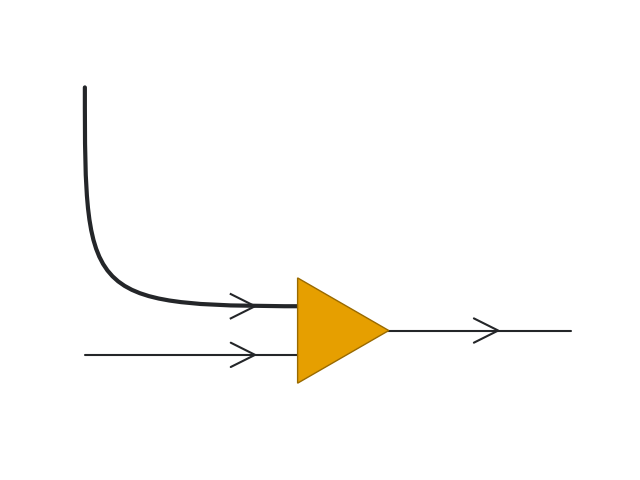
** Operations
*** Dot product
#+begin_src python :file figs/intro4.png
d = schematic.Drawing(presets=presets)
d.circle( (0, 0), preset = "center")
d.text((0,0), "$T$", fontsize=20)
d.line( (0, 0), (1, 0), arrowhead=dict(center = 0.5, reverse=True), text=dict(text="$I_1$\n", fontsize=20) )
d.circle( (3, 0), preset = "center")
d.text((3,0), "$V$", fontsize=20)
d.line( (3, 0), (2, 0), arrowhead=dict(center = 0.5), text=dict(text="$I_1$\n", fontsize=20))
d.label_fig(0.5, 0.1, "$\sum_{I_1} T_{I_1} V_{I_1} = C \in \mathbb{R} $", fontsize=20)
d.fig.savefig("figs/intro4.png")
#+end_src

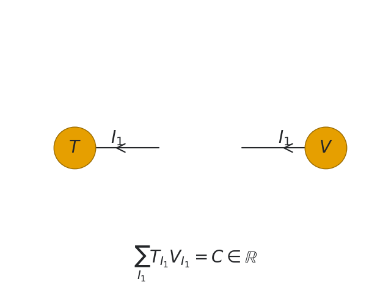
*** Contractions
#+begin_src python :file figs/intro5.png
d = schematic.Drawing(presets=presets)
d.circle( (0, 0), preset = "center")
d.text((0,0), "$T$", fontsize=20)
d.line( (0, 0), (-1, 0), arrowhead=dict(center = 0.5), text=dict(text="$I_3$\n", fontsize=20) )
d.line( (0, 0), (0, 2/3), preset="phys", text=dict(text="$I_2$\n", fontsize=20, center=0.7))
d.line( (0, 0), (1, 0), arrowhead=dict(center = 0.5, reverse=True), text=dict(text="$I_1$\n", fontsize=20) )
d.circle( (3, 0), preset = "center")
d.text((3,0), "$V$", fontsize=20)
d.line( (3, 0), (2, 0), arrowhead=dict(center = 0.5), text=dict(text="$I_1$\n", fontsize=20))
d.label_fig(0.5, 0.1, "$\sum_{I_1} T_{I_3,I_2,I_1} V_{I_1} = T'_{I_3,I_2} $", fontsize=20)
d.fig.savefig("figs/intro5.png")
#+end_src

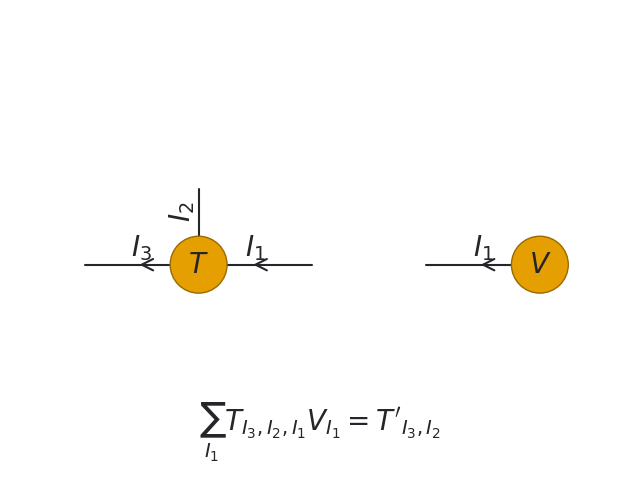
* Paper figures
** MPS
#+begin_src python 
d = schematic.Drawing(presets=presets)

for i in range(2):
    d.regular_polygon( (i, 0), n=3, orientation=-np.pi/2, preset = "left")
    d.text((i,-0.8), "$A^{\sigma_"+str(i+1)+"}$\n", fontsize=22)
    cooa = (i+ 0, 0.1)
    anca = (i -1, 0.1)
    ancb = (i -1, 0.1)
    coob = (i -1, 1)
    d.text(coob, "$\sigma_"+str(i+1)+"$\n", fontsize=22)
    d.bezier([cooa, anca, ancb, coob], linewidth=3)
    if i != 0:
        d.line( (i,-0.0), (i-1,-0.0), arrowhead=dict(center = 0.7, reverse=True) )
    d.arrowhead(ancb, cooa, center=0.7)

for i in range(3,5):
    d.regular_polygon((i+0, 0), n=3, orientation=np.pi/2, preset = "right")
    d.text((i,-0.8), "$B^{\sigma_"+str(i)+"}$\n", fontsize=22)
    cooa = (i+ 0, 0.1)
    anca = (i +1, 0.1)
    ancb = (i +1, 0.1)
    coob = (i +1, 1)
    d.bezier([cooa, anca, ancb, coob], linewidth=3)
    d.text(coob, "$\sigma_"+str(i)+"$\n", fontsize=22)
    d.arrowhead(ancb, cooa, center=0.7)
    if i != 4:
        d.line((i+0,-0.0), (i+1,-0.0), arrowhead=dict(center = 0.5, reverse=True) )

coo = (2,0)
d.text((2,-0.6), "$\Lambda$", fontsize=20)
d.marker(coo, marker=4, preset="center")
d.line((2+0,-0.0), (2+1,-0.0), arrowhead=dict(center = 0.5, reverse=True) )
d.line((2+0,-0.0), (2-1,-0.0), arrowhead=dict(center = 0.5, reverse=True) )
d.fig.savefig("figs/paper1.1.png")
d.fig.savefig("figs/paper1.1.pdf")
#+end_src
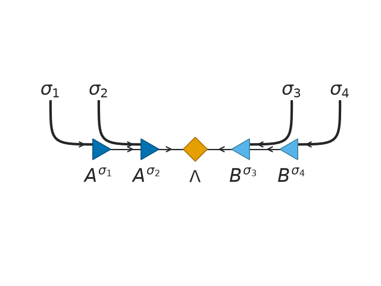
** right and left-orthogonality
*** left normalization
#+begin_src python :file figs/intro3_2.png
d = schematic.Drawing(presets=presets)
d.regular_polygon( (0, 0), n=3, orientation=np.pi/2, preset = "left")
d.line( (0, 0.1), (1, 0.1), arrowhead=dict(center = 0.5, reverse=False), linewidth=3 )
d.line( (0,-0.1), (1,-0.1), arrowhead=dict(center = 0.5, reverse=False) )
d.line( (0, 0.0), (-1, 0.0), arrowhead=dict(center = 0.5, reverse=True) )
d.text( (0,-0.5), "$A^{\sigma_i\dagger}$" , fontsize=22) 

d.regular_polygon( (1+0, 0), n=3, orientation=-np.pi/2, preset = "left")
d.line( (1+0,-0.1), (1-1,-0.1), arrowhead=dict(center = 0.5, reverse=True) )
d.line( (1+0, 0.0), (1+1, 0.0), arrowhead=dict(center = 0.5) )
d.text( (1+0,-0.5), "$A^{\sigma_i}$" , fontsize=22) 

d.text( (2+0.5,-0.0), "$=$" , fontsize=22)

d.line( (3+0, 0.0), (3+1, 0.0), arrowhead=dict(center = 0.5) )
d.text( (3+0.5,-0.5), "$I$" , fontsize=22) 
d.fig.savefig("figs/paper1.2.pdf")
d.fig.savefig("figs/paper1.2.png")
#+end_src
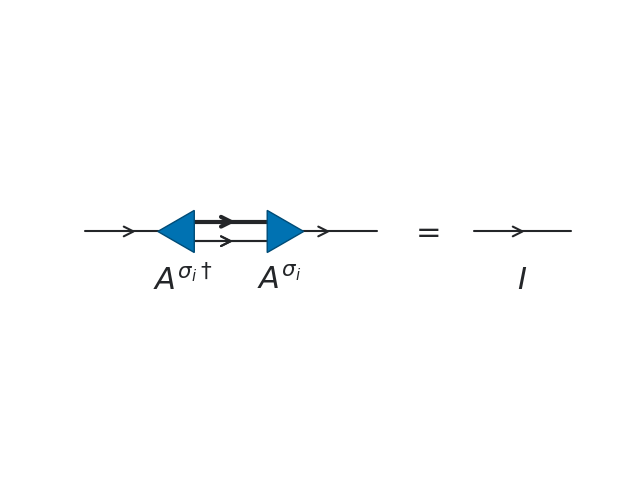
*** right normalization
#+begin_src python :file figs/intro3_2.png
d = schematic.Drawing(presets=presets)
d.regular_polygon( (0, 0), n=3, orientation=np.pi/2, preset = "right")
d.line( (0, 0.1), (1, 0.1), arrowhead=dict(center = 0.5, reverse=True), linewidth=3 )
d.line( (0,-0.1), (1,-0.1), arrowhead=dict(center = 0.5, reverse=True) )
d.line( (0, 0.0), (-1, 0.0), arrowhead=dict(center = 0.5, reverse=False) )
d.text( (0,-0.5), "$B^{\sigma_i}$" , fontsize=22) 

d.regular_polygon( (1+0, 0), n=3, orientation=-np.pi/2, preset = "right")
d.line( (1+0, 0.1), (1-1, 0.1), arrowhead=dict(center = 0.5, reverse=False) )
d.line( (1+0,-0.1), (1-1,-0.1), arrowhead=dict(center = 0.5, reverse=False) )
d.line( (1+0, 0.0), (1+1, 0.0), arrowhead=dict(center = 0.5, reverse=True) )
d.text( (1+0,-0.5), "$B^{\sigma_i\dagger}$" , fontsize=22) 

d.text( (2+0.5,-0.0), "$=$" , fontsize=22)

d.line( (3+0, 0.0), (3+1, 0.0), arrowhead=dict(center = 0.5, reverse=True) )
d.text( (3+0.5,-0.5), "$I$" , fontsize=22) 
d.fig.savefig("figs/paper1.3.pdf")
d.fig.savefig("figs/paper1.3.png")
#+end_src
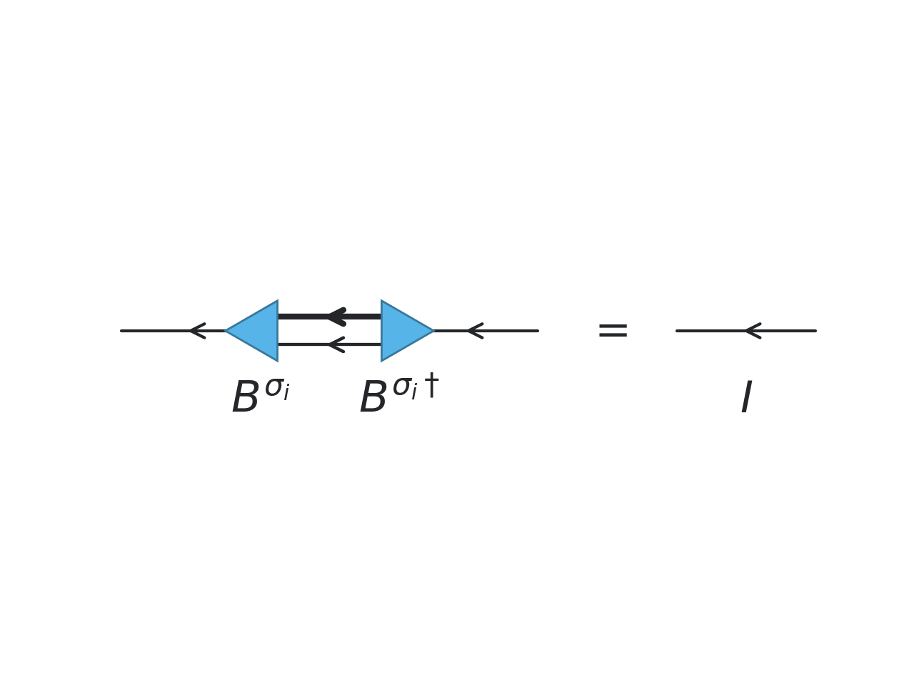
*** left normalization with correct orientation
#+begin_src python :file figs/intro3_2.png
import matplotlib
params = {
  "text.usetex": True,
  "text.latex.preamble": r"\usepackage{braket}",
}
matplotlib.rcParams.update(params)

d = schematic.Drawing(presets=presets)

#d.text((-2,0), "$\ket{\psi}:$", fontsize=22)
for i in range(1,2):
    d.regular_polygon( (i, 0), n=3, orientation=-np.pi/2, preset = "left")
    d.text((i,-0.5), "$A^{\sigma_"+"i"+"}$\n", fontsize=22)
    cooa = (i+ 0, 0.1)
    anca = (i -1, 0.1)
    ancb = (i -1, 0.1)
    coob = (i -1, 0.6)
    d.bezier([cooa, anca, ancb, coob], linewidth=3)
    d.arrowhead(ancb, cooa, center=0.5)
    cooa = (i+ 0, 0.0)
    anca = (i -1.1, 0.0)
    ancb = (i -1.1, 0.0)
    coob = (i -1.1, 0.5)
    d.bezier( [cooa, anca, ancb, coob], linewidth=1 )

coo = (2,0)
#d.text((2,-0.6), "$\Lambda$", fontsize=20)
#d.marker(coo, marker=4, preset="center")
#d.line((2+0,-0.0), (2+1,-0.0), arrowhead=dict(center = 0.5, reverse=True) )
d.line((2+0,-0.0), (2-1,-0.0), arrowhead=dict(center = 0.5, reverse=True) )
d.fig.savefig("figs/paper1.2.2.png")
d.fig.savefig("figs/paper1.2.2.pdf")

#d.text((-2,5), "$\\bra{\psi}:$", fontsize=22)
for i in range(1,2):
    d.regular_polygon( (i, 1), n=3, orientation=-np.pi/2, preset = "left")
    d.text((i,1+0.3), "$A^{\sigma_"+"i"+"\dagger}$\n", fontsize=22)
    cooa = (i+ 0, 0.9)
    anca = (i -1, 0.9)
    ancb = (i -1, 0.9)
    coob = (i -1, 0.6)
    d.bezier([cooa, anca, ancb, coob], linewidth=3)
    d.arrowhead(ancb, cooa, center=0.5, reverse=True)
    cooa = (i+ 0, 1.0)
    anca = (i -1.1, 1.0)
    ancb = (i -1.1, 1.0)
    coob = (i -1.1, 0.5)
    d.bezier( [cooa, anca, ancb, coob], linewidth=1 )
    d.arrowhead(ancb, coob, center=0.9, reverse=False)

coo = (2,1)
#d.text((2,5+0.5), "$\Lambda^{\dagger}$", fontsize=20)
#d.marker(coo, marker=4, preset="center")
#d.line((2+0,5-0.0), (2+1,5-0.0), arrowhead=dict(center = 0.5, reverse=True) )
d.line((2+0,1-0.0), (2-1,1-0.0), arrowhead=dict(center = 0.5, reverse=False) )

d.text( (2+0.5, 0.5), "$=$" , fontsize=22)

d.line( (3+0, 0.5), (3+1, 0.5), arrowhead=dict(center = 0.5) )
d.text( (3+0.5, 0.0), "$I$" , fontsize=22)
d.fig.savefig("figs/paper1.2.2.png")
d.fig.savefig("figs/paper1.2.2.pdf")
#+end_src
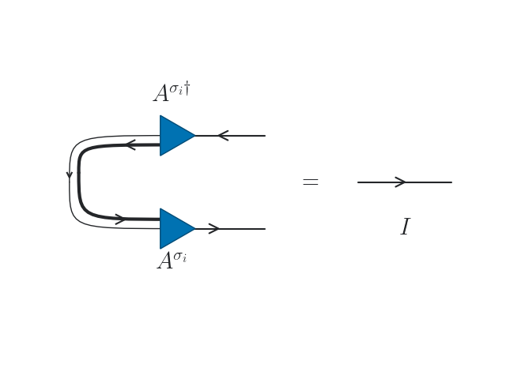
*** right normalization with correct orientation
#+begin_src python
import matplotlib
params = {
  "text.usetex": True,
  "text.latex.preamble": r"\usepackage{braket}",
}
matplotlib.rcParams.update(params)

d = schematic.Drawing(presets=presets)

for i in range(3,4):
    d.regular_polygon((i+0, 0), n=3, orientation=np.pi/2, preset = "right")
    d.text((i,-0.5), "$B^{\sigma_"+str(i)+"}$\n", fontsize=22)
    cooa = (i+ 0, 0.1)
    anca = (i +1, 0.1)
    ancb = (i +1, 0.1)
    coob = (i +1, 0.4)
    d.bezier([cooa, anca, ancb, coob], linewidth=3)
    #d.text(coob, "$\sigma_"+str(i)+"$\n", fontsize=22)
    d.arrowhead(ancb, cooa, center=0.7)
    cooa = (i+ 0, 0.0)
    anca = (i +1.1, 0.0)
    ancb = (i +1.1, 0.0)
    coob = (i +1.1, 0.3)
    d.bezier([cooa, anca, ancb, coob], linewidth=1 )

coo = (2,0)
#d.text((2,-0.6), "$\Lambda$", fontsize=20)
#d.marker(coo, marker=4, preset="center")
d.line((2+0,-0.0), (2+1,-0.0), arrowhead=dict(center = 0.5, reverse=True) )
#d.line((2+0,-0.0), (2-1,-0.0), arrowhead=dict(center = 0.5, reverse=True) )
d.fig.savefig("figs/paper1.3.1.png")
d.fig.savefig("figs/paper1.3.1.pdf")

for i in range(3,4):
    d.regular_polygon((i+0, 1), n=3, orientation=np.pi/2, preset = "right")
    d.text((i,1+0.2), "$B^{\sigma_"+str(i)+"\dagger}$\n", fontsize=22)
    cooa = (i+ 0, 0.9)
    anca = (i +1, 0.9)
    ancb = (i +1, 0.9)
    coob = (i +1, 0.4)
    d.bezier([cooa, anca, ancb, coob], linewidth=3)
    #d.text((i+1,3.3), "$\sigma_"+str(i)+"$\n", fontsize=22)
    d.arrowhead(ancb, cooa, center=0.5, reverse=True)
    cooa = (i+ 0, 1.0)
    anca = (i +1.1, 1.0)
    ancb = (i +1.1, 1.0)
    coob = (i +1.1, 0.3)
    d.bezier([cooa, anca, ancb, coob], linewidth=1 )
    d.arrowhead(ancb, coob, center=0.7, reverse=False)

coo = (2,5)
#d.text((2,5+0.5), "$\Lambda^{\dagger}$", fontsize=20)
#d.marker(coo, marker=4, preset="center")
d.line((2+0,1-0.0), (2+1,1-0.0), arrowhead=dict(center = 0.5, reverse=False) )
#d.line((2+0,5-0.0), (2-1,5-0.0), arrowhead=dict(center = 0.5, reverse=False) )

d.text( (4+0.5, 0.5), "$=$" , fontsize=22)

d.line( (5+0, 0.5), (5+1, 0.5), arrowhead=dict(center = 0.5, reverse=True) )
d.text( (5+0.5, 0.0), "$I$" , fontsize=22)
d.fig.savefig("figs/paper1.3.1.png")
d.fig.savefig("figs/paper1.3.1.pdf")
#+end_src
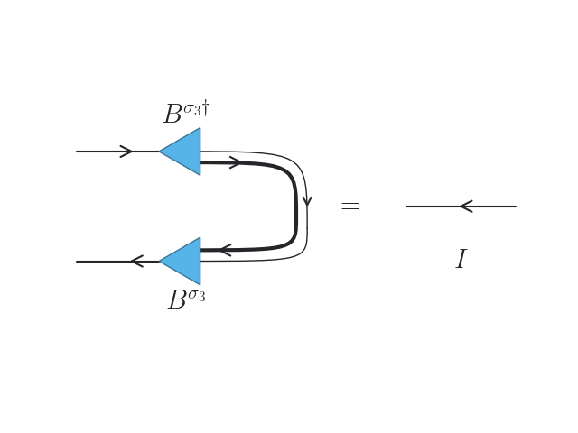
** Symmetry
#+begin_src python :file figs/multi_edges2.png
d = schematic.Drawing(presets=presets)

d.regular_polygon( (0, 0), n=4, orientation=np.pi/1, preset = "center")
d.text((0+0.0, 0.00), "$\Lambda$", fontsize=15)

# draw virtual bond
d.line((0, 0.20), (0 + 1, 0.20), preset="bond", arrowhead=dict(center=0.5, reverse=True))
d.line((0, 0.10), (0 + 1, 0.10), preset="bond", arrowhead=dict(center=0.5, reverse=True))
#d.line((0, 0.00), (0 + 1, 0.00), preset="bond")
d.text((0+0.5, 0.03), "$\dots$", fontsize=8)
d.line((0,-0.10), (0 + 1,-0.10), preset="bond", arrowhead=dict(center=0.5, reverse=True))
d.line((0,-0.20), (0 + 1,-0.20), preset="bond", arrowhead=dict(center=0.5, reverse=True))
d.text((0+1.4, 0.20), "$(N^B_1,M^B_1)$", fontsize=8)
d.text((0+1.4, 0.00), "$(N^B_i,M^B_i)$", fontsize=8)
d.text((0+1.4,-0.20), "$(N^B_k,M^B_k)$", fontsize=8)

# draw virtual bond
d.line((0, 0.20), (0 - 1, 0.20), preset="bond", arrowhead=dict(center=0.5, reverse=True))
d.line((0, 0.10), (0 - 1, 0.10), preset="bond", arrowhead=dict(center=0.5, reverse=True))
#d.line((0, 0.00), (0 - 1, 0.00), preset="bond")
d.text((0-0.5, 0.03), "$\dots$", fontsize=8)
d.line((0,-0.10), (0 - 1,-0.10), preset="bond", arrowhead=dict(center=0.5, reverse=True))
d.line((0,-0.20), (0 - 1,-0.20), preset="bond", arrowhead=dict(center=0.5, reverse=True))
d.text((0-1.4, 0.20), "$(N^A_1,M^A_1)$", fontsize=8)
d.text((0-1.4, 0.00), "$(N^A_i,M^A_i)$", fontsize=8)
d.text((0-1.4,-0.20), "$(N^A_l,M^A_l)$", fontsize=8)

d.text((0+1.8, 0.00), "$\Leftrightarrow$", fontsize=15)

d.regular_polygon( (3.0, 0), n=4, orientation=np.pi/1, preset = "center")
d.text((0+3.0, 0.00), "$\Lambda$", fontsize=15)
d.line((2.0, 0.00), (0 + 3.0, 0.00), preset="bond", arrowhead=dict(center=0.5, reverse=False))
d.line((4.0, 0.00), (0 + 3.0, 0.00), preset="bond", arrowhead=dict(center=0.5, reverse=False))

d.fig.savefig("figs/paper1.3.0.png")
d.fig.savefig("figs/paper1.3.0.pdf")
#+end_src
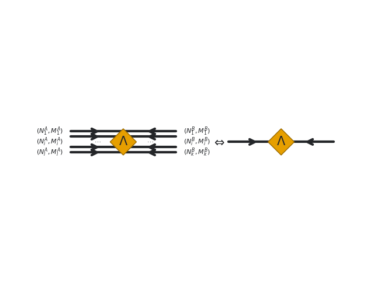
** RDM 1
#+begin_src python
import matplotlib
params = {
  "text.usetex": True,
  "text.latex.preamble": r"\usepackage{braket}",
}
matplotlib.rcParams.update(params)

d = schematic.Drawing(presets=presets)

d.text((-2,0), "$\ket{\psi}:$", fontsize=22)
for i in range(2):
    d.regular_polygon( (i, 0), n=3, orientation=-np.pi/2, preset = "left")
    d.text((i,-0.8), "$A^{\sigma_"+str(i+1)+"}$\n", fontsize=22)
    cooa = (i+ 0, 0.1)
    anca = (i -1, 0.1)
    ancb = (i -1, 0.1)
    coob = (i -1, 1)
    d.text(coob, "$\sigma_"+str(i+1)+"$\n", fontsize=22)
    d.bezier([cooa, anca, ancb, coob], linewidth=3)
    if i != 0:
        d.line( (i,-0.0), (i-1,-0.0), arrowhead=dict(center = 0.7, reverse=True) )
    d.arrowhead(ancb, cooa, center=0.7)

for i in range(3,5):
    d.regular_polygon((i+0, 0), n=3, orientation=np.pi/2, preset = "right")
    d.text((i,-0.8), "$B^{\sigma_"+str(i)+"}$\n", fontsize=22)
    cooa = (i+ 0, 0.1)
    anca = (i +1, 0.1)
    ancb = (i +1, 0.1)
    coob = (i +1, 1)
    d.bezier([cooa, anca, ancb, coob], linewidth=3)
    d.text(coob, "$\sigma_"+str(i)+"$\n", fontsize=22)
    d.arrowhead(ancb, cooa, center=0.7)
    if i != 4:
        d.line((i+0,-0.0), (i+1,-0.0), arrowhead=dict(center = 0.5, reverse=True) )

coo = (2,0)
d.text((2,-0.6), "$\Lambda$", fontsize=20)
d.marker(coo, marker=4, preset="center")
d.line((2+0,-0.0), (2+1,-0.0), arrowhead=dict(center = 0.5, reverse=True) )
d.line((2+0,-0.0), (2-1,-0.0), arrowhead=dict(center = 0.5, reverse=True) )
d.fig.savefig("figs/paper1.4.png")
d.fig.savefig("figs/paper1.4.pdf")

d.text((-2,5), "$\\bra{\psi}:$", fontsize=22)
for i in range(2):
    d.regular_polygon( (i, 5), n=3, orientation=-np.pi/2, preset = "left")
    d.text((i,5+0.2), "$A^{\sigma_"+str(i+1)+"\dagger}$\n", fontsize=22)
    cooa = (i+ 0, 4.9)
    anca = (i -1, 4.9)
    ancb = (i -1, 4.9)
    coob = (i -1, 3.8)
    d.text((i-1, 3.3), "$\sigma_"+str(i+1)+"$\n", fontsize=22)
    d.bezier([cooa, anca, ancb, coob], linewidth=3)
    if i != 0:
        d.line( (i,5-0.0), (i-1,5-0.0), arrowhead=dict(center = 0.5, reverse=False) )
    d.arrowhead(ancb, cooa, center=0.5, reverse=True)

for i in range(3,5):
    d.regular_polygon((i+0, 5), n=3, orientation=np.pi/2, preset = "right")
    d.text((i,5+0.2), "$B^{\sigma_"+str(i)+"\dagger}$\n", fontsize=22)
    cooa = (i+ 0, 4.9)
    anca = (i +1, 4.9)
    ancb = (i +1, 4.9)
    coob = (i +1, 3.8)
    d.bezier([cooa, anca, ancb, coob], linewidth=3)
    d.text((i+1,3.3), "$\sigma_"+str(i)+"$\n", fontsize=22)
    d.arrowhead(ancb, cooa, center=0.5, reverse=True)
    if i != 4:
        d.line((i+0,5-0.0), (i+1,5-0.0), arrowhead=dict(center = 0.5, reverse=False) )

coo = (2,5)
d.text((2,5+0.5), "$\Lambda^{\dagger}$", fontsize=20)
d.marker(coo, marker=4, preset="center")
d.line((2+0,5-0.0), (2+1,5-0.0), arrowhead=dict(center = 0.5, reverse=False) )
d.line((2+0,5-0.0), (2-1,5-0.0), arrowhead=dict(center = 0.5, reverse=False) )
d.fig.savefig("figs/paper1.4.png")
d.fig.savefig("figs/paper1.4.pdf")
#+end_src
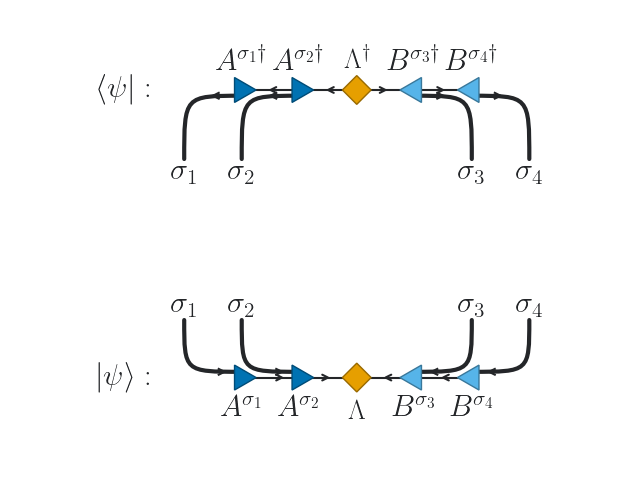
** RDM 2: contracted
#+begin_src python
import matplotlib
params = {
  "text.usetex": True,
  "text.latex.preamble": r"\usepackage{braket}",
}
matplotlib.rcParams.update(params)

d = schematic.Drawing(presets=presets)

d.text((2.5, 3.5), "$\\hat{\\rho}_A = Tr_B \ket{\psi}\\bra{\psi} $", fontsize=22)
for i in range(2):
    d.regular_polygon( (i, 0), n=3, orientation=-np.pi/2, preset = "left")
    d.text((i,-0.8), "$A^{\sigma_"+str(i+1)+"}$\n", fontsize=22)
    cooa = (i+ 0, 0.1)
    anca = (i -1, 0.1)
    ancb = (i -1, 0.1)
    coob = (i -1, 1)
    #d.text(coob, "$\sigma_"+str(i+1)+"$\n", fontsize=22)
    d.bezier([cooa, anca, ancb, coob], linewidth=3)
    if i != 0:
        d.line( (i,-0.0), (i-1,-0.0), arrowhead=dict(center = 0.7, reverse=True) )
    d.arrowhead(ancb, cooa, center=0.7)

for i in range(3,5):
    d.regular_polygon((i+0+1, 0), n=3, orientation=np.pi/2, preset = "right")
    d.text((i+1,-0.8), "$B^{\sigma_"+str(i)+"}$\n", fontsize=22)
    cooa = (i+ 0+1, 0.1)
    anca = (i +1+1, 0.1)
    ancb = (i +1+1, 0.1)
    coob = (i +1+1, 1)
    d.bezier([cooa, anca, ancb, coob], linewidth=3)
    #d.text(coob, "$\sigma_"+str(i)+"$\n", fontsize=22)
    d.arrowhead(ancb, cooa, center=0.7)
    if i != 4:
        d.line((i+0+1,-0.0), (i+1+1,-0.0), arrowhead=dict(center = 0.5, reverse=True) )

coo = (2+1,0)
d.text((2+1,-0.6), "$\Lambda$", fontsize=20)
d.marker(coo, marker=4, preset="center")
d.line((2+0+1,-0.0), (2+1.0+1,-0.0), arrowhead=dict(center = 0.5, reverse=True) )
d.line((2+0+1,-0.0), (2-0.5+1,-0.0), arrowhead=dict(center = 0.3, reverse=True) )
d.line((2-0.0,-0.0), (2-1.0+0,-0.0), arrowhead=dict(center = 0.5, reverse=True) )
d.fig.savefig("figs/paper1.4.png")
d.fig.savefig("figs/paper1.4.pdf")

#d.text((-2,2), "$\\bra{\psi}:$", fontsize=22)
for i in range(2):
    d.regular_polygon( (i, 2), n=3, orientation=-np.pi/2, preset = "left")
    d.text((i,2+0.2), "$A^{\sigma_"+str(i+1)+"\dagger}$\n", fontsize=22)
    cooa = (i+ 0, 1.9)
    anca = (i -1, 1.9)
    ancb = (i -1, 1.9)
    coob = (i -1, 0.8)
    #d.text((i-1, 1.3), "$\sigma_"+str(i+1)+"$\n", fontsize=22)
    d.bezier([cooa, anca, ancb, coob], linewidth=3)
    if i != 0:
        d.line( (i,2-0.0), (i-1,2-0.0), arrowhead=dict(center = 0.5, reverse=False) )
    d.arrowhead(ancb, cooa, center=0.5, reverse=True)

for i in range(3,5):
    d.regular_polygon((i+0+1, 2), n=3, orientation=np.pi/2, preset = "right")
    d.text((i+1,2+0.2), "$B^{\sigma_"+str(i)+"\dagger}$\n", fontsize=22)
    cooa = (i+ 0+1, 1.9)
    anca = (i +1+1, 1.9)
    ancb = (i +1+1, 1.9)
    coob = (i +1+1, 0.8)
    d.bezier([cooa, anca, ancb, coob], linewidth=3)
    d.arrowhead(ancb, cooa, center=0.5, reverse=True)
    if i != 4:
        d.line((i+0+1,2-0.0), (i+1+1,2-0.0), arrowhead=dict(center = 0.5, reverse=False) )

coo = (2+1,2)
d.text((2+1,2+0.5), "$\Lambda^{\dagger}$", fontsize=20)
d.marker(coo, marker=4, preset="center")
d.line((2+0+1,2-0.0), (2+1.0+1,2-0.0), arrowhead=dict(center = 0.5, reverse=False) )
d.line((2+0+1,2-0.0), (2-0.5+1,2-0.0), arrowhead=dict(center = 0.8, reverse=False) )
d.line((2-0.0,2-0.0), (2-1.0+0,2-0.0), arrowhead=dict(center = 0.5, reverse=False) )
d.fig.savefig("figs/paper1.5.png")
d.fig.savefig("figs/paper1.5.pdf")
#+end_src
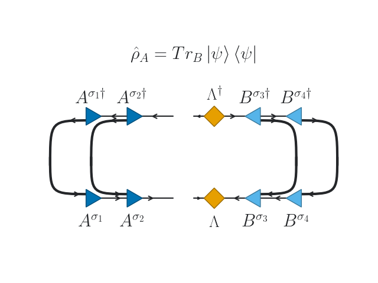
* Example 1

#+begin_src python :session *Python* :async :results none
from quimb import schematic

presets = {
    "bond": {"linewidth": 3},
    "phys": {"linewidth": 1.5},
    "center": {
        # `get_color` uses more colorblind friendly colors
        "color": schematic.get_color("orange"),
        "hatch": "/////",
    },
    "left": {
        "color": schematic.get_color("bluedark"),
    },
    "right": {
        "color": schematic.get_color("blue"),
    },
}

#+end_src

** Draw a figure

#+begin_src python :file figs/hello.png

d = schematic.Drawing(presets=presets)

L = 12
center = 6

for i in range(L):
    # draw tensor
    d.circle(
        (i, 0),
        preset=(
            "center" if i == center else "left" if i < center else "right"
        ),
    )

    # draw physical index
    d.line((i+1/9, 0), (i+1/9, -2 / 3), preset="phys")
    d.line((i, 0), (i, -2 / 3), preset="phys")

    # draw virtual bond
    if i + 1 < L:
        d.line((i, 0), (i + 1, 0), preset="bond")

    # draw isometric conditions
    if i != center:
        d.arrowhead((i, -2 / 3), (i, 0), preset="phys")
        d.arrowhead((i+1/9, -2 / 3), (i+1/9, 0), preset="phys")
    if i < center - 1:
        d.arrowhead((i, 0), (i + 1, 0), preset="bond")
    if i > center + 1:
        d.arrowhead((i, 0), (i - 1, 0), preset="bond")

d.fig.savefig("figs/hello.png")
#+end_src

[[file:figs/hello.png]]
** Multi-edges
#+begin_src python :file figs/multi_edges.png 
d = schematic.Drawing()

pa, pb = (0, 0, 0), (0, 1, 1)

green = schematic.get_color("green")
red = schematic.get_color("red")
blue = schematic.get_color("blue")

d.circle(pa, color=green)
d.circle(pb, color=red)

# you can still use arrowheads and text labels
d.line_offset(
    pa, pb, 0.2, arrowhead=dict(center=0.9), text="forwards\n", color=blue
)
d.line_offset(
    pa,
    pb,
    0.0,
    arrowhead=dict(center=0.9, reverse=True),
    text="backwards\n",
    color=blue,
)
d.line_offset(
    pa,
    pb,
    -0.2,
    arrowhead=dict(center=0.9, reverse="both"),
    text="both ways!\n",
    color=blue,
    midlength=0.4,
)

d.fig.savefig("figs/multi_edges.png")
#+end_src

[[file:figs/multi_edges.png]]

** Multi-edges II

#+begin_src python :file figs/multi_edges2.png
d = schematic.Drawing(presets=presets)

L = 8
center = 4

for i in range(L):
    # draw tensor
    d.circle(
        (i, 0),
        preset=(
            "center" if i == center else "left" if i < center else "right"
        ),
    )

    # draw physical index
    d.line((i, 0), (i, -2 / 3), preset="phys")

    # draw virtual bond
    if i + 1 < L:
        #d.line((i, 0), (i + 1, 0), preset="bond")
        d.line_offset(
            (i,0), (i+1,0), 0.2, arrowhead=dict(center=0.5)
        )
        d.line_offset(
            (i,0), (i+1,0), 0.1, arrowhead=dict(center=0.5)
        )
        d.line_offset(
            (i,0), (i+1,0), 0.0, arrowhead=dict(center=0.5)
        )
        d.line_offset(
            (i,0), (i+1,0),-0.1, arrowhead=dict(center=0.5)
        )
        d.line_offset(
            (i,0), (i+1,0),-0.2, arrowhead=dict(center=0.5)
        )

d.fig.savefig("figs/multi_edges2.png")
#+end_src

[[file:figs/multi_edges2.png]]
